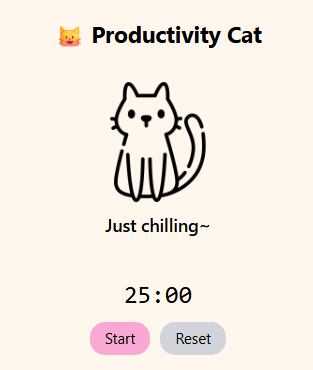

# 🐱 ProCat – Your Productivity Cat

ProCat is a fun little Chrome Extension that keeps you company while you work.  
A cute animated cat sits inside your browser popup, showing different moods depending on your focus, breaks, or idle time. ✨  

## ✨ Features
- 🐾 **Mood animations**: The cat wiggles, bounces, or shakes depending on its current mood.  
- 🎨 **Tailwind CSS styling** for a clean UI.  
- 🎬 **Framer Motion animations** to bring the cat to life.  
- 📦 Built with **Vite + React** for fast development.  

1. Clone the repo
2. Install dependencies
   npm install
3. Run locally
   npm run dev
4. Build for Chrome Extension
   npm run build

5.Load as Chrome Extension
Now ProCat will appear in the Chrome extensions bar!

📜 License

MIT License – feel free to use, modify, and share.
Made with ❤️ for fun and productivity.

